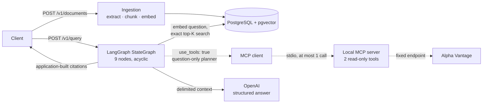

# FinTech Research Agent

A small, backend-only learning and research project. You upload financial documents, ask questions, and get answers grounded only in those documents, with citations that the application builds and checks itself. With `use_tools: true` it may make one bounded, read-only market-data lookup over MCP.

> **Not financial advice.** This is a learning and research backend. It is not an investment product, it is not production-ready, and nothing it returns is investment advice. Market data comes from a third-party provider, may be end-of-day, and is never described as real-time.

## Problem and primary scenario

Answers about a financial filing are only useful if you can check them against the filing. A plain chat model can answer from memory, invent figures, or quote text that is not in the source.

The primary scenario: an analyst uploads a company's quarterly statements as a PDF and asks, "What were total net sales for the quarter?" The service answers from the uploaded text only, and each claim carries a citation with the filename, page, and an excerpt that is an exact substring of the stored text. If the documents do not support an answer, the service says so instead of guessing. Optionally, the same question can also ask for the latest available market quote for a ticker, and the answer then cites the provider data separately.

## Architecture

One FastAPI process owns the HTTP API and the answering graph.



### Document flow: upload to grounded answer

1. **Upload.** `POST /v1/documents` accepts `.pdf` (text-based, no OCR), `.txt`, and `.md`, up to 10 MiB by default. A SHA-256 check returns `200 already_ingested` for a duplicate.
2. **Extraction.** `pypdf` extracts text page by page, so every chunk keeps its page number.
3. **Chunking.** Text is split into ~800-token windows with ~120-token overlap (`cl100k_base`). A chunk never spans a PDF page.
4. **Embeddings.** Chunks are embedded with OpenAI `text-embedding-3-small` (1536 dimensions). The document and all its chunks are stored in one transaction.
5. **Retrieval.** `POST /v1/query` embeds the question and runs an exact cosine search for the top 6 chunks, keeping those with similarity ≥ 0.30.
6. **Grounded answer.** With no evidence, the graph returns a fixed insufficient-context answer and never calls the answer model. Otherwise the model sees the chunks as delimited, untrusted data and must cite request-local labels (`D1…Dn`).
7. **Citations.** The application maps each label back to its stored chunk and builds the citation itself: document and chunk IDs, filename, page, and an excerpt sliced from the stored text. Unknown labels are dropped.

### Optional market-data path: planner → MCP → Alpha Vantage

1. **Gate.** Runs only when the request sets `use_tools: true` and `ALPHA_VANTAGE_API_KEY` was set at startup. Otherwise the graph answers from documents only.
2. **Planner.** A strict structured-output call that sees only the question (never document text) may choose one of two allow-listed tools and a ticker symbol.
3. **Approval.** Application code checks the tool name against the allow-list and validates the symbol. The MCP server validates the symbol again.
4. **One call.** At most one `tools/call` per query to the local stdio MCP server, which calls a fixed Alpha Vantage endpoint with a bounded timeout.
5. **Citation.** A validated result becomes a trusted `T1` context block and an application-built citation with the provider, symbol, `as_of`, and allow-listed fields. `tools_used` reports only a validated success. Any planning or tool failure falls back to documents.

### Component responsibilities

| Module | Responsibility |
|---|---|
| `app/main.py` | FastAPI app, lifespan (pool, OpenAI client, optional MCP child), thin routes, error envelope, request-ID middleware |
| `app/config.py` | Environment parsing and startup validation |
| `app/db.py` | All SQL and the psycopg pool; the only module that imports psycopg |
| `app/ingestion.py`, `app/tokenizer.py` | Validation, extraction, chunking, and the ingestion transaction; lazy tokenizer loading |
| `app/retrieval.py` | Query embedding, top-K search, similarity threshold |
| `app/graph.py` | The compiled LangGraph `StateGraph` |
| `app/prompts.py`, `app/citations.py` | Delimited prompts; label validation and application-built citations |
| `app/openai_provider.py` | OpenAI embeddings, structured answer, tool planner |
| `app/mcp_server.py`, `app/mcp_client.py` | Local read-only MCP server (`get_market_quote`, `get_company_overview`) and the application's client |
| `app/market_data.py`, `app/symbols.py` | Alpha Vantage adapter; canonical ticker validation |
| `migrations/001_initial.sql` | The schema, applied with `psql`; no migration framework |
| `scripts/verify.py` | The full offline verification gate |

The contract and design are in [docs/SPEC.md](docs/SPEC.md), [docs/DECISIONS.md](docs/DECISIONS.md), [docs/TECH_BASELINE.md](docs/TECH_BASELINE.md), and [docs/TASKS.md](docs/TASKS.md).

## Setup

### Prerequisites

- Python 3.12 (`requires-python = ">=3.12,<3.13"`).
- [uv](https://docs.astral.sh/uv/). CI uses uv 0.12.15.
- PostgreSQL with the pgvector extension. The project was verified with PostgreSQL 18.6 and pgvector 0.8.6.
- An OpenAI API key to run the server. Tests need no key.
- Optional: an Alpha Vantage API key for the market-data path.

### Install and migrate

```bash
uv sync --locked
```

The commands below assume a Homebrew PostgreSQL 18 on port 5433, which is how the project was developed. Any PostgreSQL with pgvector works; adjust the host, port, and paths.

```bash
PG=/opt/homebrew/opt/postgresql@18/bin
$PG/pg_ctl -D /opt/homebrew/var/postgresql@18 -o "-p 5433" -l /tmp/pg18.log start
$PG/createdb -h 127.0.0.1 -p 5433 fintech
$PG/createdb -h 127.0.0.1 -p 5433 fintech_test   # disposable; the test fixtures reset it
$PG/psql -h 127.0.0.1 -p 5433 -d fintech -v ON_ERROR_STOP=1 -f migrations/001_initial.sql
```

The migration is one idempotent SQL file. It runs `CREATE EXTENSION IF NOT EXISTS vector`, so the role that applies it needs permission to create that extension.

### Environment variables

```bash
cp .env.example .env      # then set OPENAI_API_KEY; never commit .env
```

[`.env.example`](.env.example) documents every variable. Keys have no defaults.

| Variable | Required | Purpose |
|---|---|---|
| `DATABASE_URL` | yes (server) | Application database |
| `OPENAI_API_KEY` | yes (server) | Embeddings, answers, planner |
| `TEST_DATABASE_URL` | yes (gate) | Disposable test database; its name must end in `_test` and differ from `DATABASE_URL` |
| `ALPHA_VANTAGE_API_KEY` | no | Enables the market-data path; unset means documents only |
| `MCP_TOOL_TIMEOUT_SECONDS` | no | Provider timeout, `0 < value <= 30`, default 5 |
| `OPENAI_EMBEDDING_MODEL`, `OPENAI_EMBEDDING_DIMENSIONS` | no | Pinned to `text-embedding-3-small` / `1536`; any other value stops startup |
| `OPENAI_LLM_MODEL` | no | Answer and planner model, default `gpt-6-luna` |
| `MAX_UPLOAD_BYTES` | no | Upload limit, default 10 MiB |
| `RETRIEVAL_TOP_K`, `MIN_RETRIEVAL_SIMILARITY` | no | Retrieval tuning, defaults 6 and 0.30 |
| `TIKTOKEN_CACHE_DIR` | no | tiktoken cache; the first ingestion downloads `cl100k_base` once otherwise |

## Run

```bash
uv run --env-file .env fastapi dev app/main.py        # http://127.0.0.1:8000
```

The application reads only its environment; `--env-file .env` passes it the values from `.env`.

```bash
curl -s http://127.0.0.1:8000/health
# {"status":"ok","database":"ok"}; 503 with the error envelope when the database is down

curl -s -F "file=@/path/to/statements.pdf;type=application/pdf" \
  http://127.0.0.1:8000/v1/documents
# 201 {"document_id": "...", "filename": "...", "sha256": "...", "page_count": 3, "chunk_count": 3, "status": "ingested"}
```

**RAG-only query:**

```bash
curl -s -H 'Content-Type: application/json' \
  -d '{"question": "What were total net sales for the three months ended March 29, 2025?", "use_tools": false}' \
  http://127.0.0.1:8000/v1/query
```

**RAG + MCP query** (needs `ALPHA_VANTAGE_API_KEY` at startup):

```bash
curl -s -H 'Content-Type: application/json' \
  -d '{"question": "What were total net sales for the three months ended March 29, 2025, and what is the latest available market quote for AAPL?", "use_tools": true}' \
  http://127.0.0.1:8000/v1/query
```

A response with both evidence types (shape from [docs/SPEC.md](docs/SPEC.md) §6.3):

```json
{
  "answer": "The filing states ... [D1] The provider's latest available quote is ... [T1]",
  "status": "answered",
  "citations": [
    {"id": "D1", "source_type": "document", "document_id": "uuid", "chunk_id": "uuid",
     "filename": "report.pdf", "page": 1, "excerpt": "..."},
    {"id": "T1", "source_type": "mcp", "tool": "get_market_quote", "provider": "alpha_vantage",
     "symbol": "AAPL", "as_of": "YYYY-MM-DD",
     "fields": {"price": "...", "previous_close": "...", "change": "...",
                "change_percent": "...", "volume": "...", "latest_trading_day": "YYYY-MM-DD"}}
  ],
  "tools_used": ["get_market_quote"]
}
```

When the documents do not support an answer, the response is `200` with `"status": "insufficient_context"`, a fixed answer, and no citations. Errors use one envelope: `{"error": {"code": "...", "message": "..."}}`.

## Tests and verification

```bash
export TEST_DATABASE_URL=postgresql://localhost:5433/fintech_test
uv run python scripts/verify.py
```

`scripts/verify.py` is the full gate. It runs `uv lock --check`, `ruff format --check`, `ruff check`, strict `mypy`, and the full `pytest` suite, and it fails if any test is skipped. Without `TEST_DATABASE_URL`, the database tests would skip, so the gate refuses to run.

- **Safety.** The database tests drop their tables on every run. The fixtures refuse any database whose name does not end in `_test`, or that is the `DATABASE_URL` target.
- **Offline.** Automated tests never call OpenAI or Alpha Vantage. They use deterministic fakes and need no real keys.
- **CI.** [.github/workflows/ci.yml](.github/workflows/ci.yml) runs the same gate on pull requests and pushes to `main`, against a pgvector service container, with every provider variable unset and no repository secrets.

## Exact pgvector search, not ANN

Retrieval is an exact cosine scan (`ORDER BY embedding <=> query LIMIT 6`). The migration creates no HNSW or IVFFlat index, only B-tree indexes.

- **Why exact.** For a small corpus, exact search is correct by construction and fast enough. With 2,000 random 1536-dimensional chunks, PostgreSQL 18.6 with pgvector 0.8.6 ran a sequential scan with a top-N heapsort in about 5 ms ([docs/DECISIONS.md](docs/DECISIONS.md) §8).
- **What ANN would cost.** An approximate index trades recall for speed. It adds build time and tuning parameters (`m`/`ef_search` for HNSW, `lists`/`probes` for IVFFlat), and results can silently miss the true nearest chunk.
- **When it would be worth it.** Only for a corpus much larger than this project targets, where the measured exact-scan latency is no longer acceptable. That has not been measured here.

## Security and trust boundaries

These are the boundaries the code enforces. They are design properties tested with fakes, not an external audit.

- **Documents are untrusted data.** Retrieved text is delimited from the instructions in every prompt. The tool planner never sees document text, so an instruction inside a document cannot choose a tool or a symbol.
- **The model does not own citations.** Labels are request-local; the application builds every citation and every excerpt from stored data and drops unknown labels.
- **No evidence, no answer.** Weak or absent retrieval returns the fixed insufficient-context response without calling the answer model.
- **Bounded tools.** Two allow-listed, read-only tools; at most one call per query; symbols validated on both sides of MCP; a fixed provider endpoint; no caller-supplied URLs or tool names.
- **Secrets.** Keys come from the environment only and have no defaults. Logs carry no keys, connection strings, prompts, questions, document text, or provider bodies. SQL is parameterized.

Not covered: there is no authentication, rate limiting, or multi-tenancy, uploaded files are parsed in-process without sandboxing, and the service is meant to run locally. To report a vulnerability, see [SECURITY.md](SECURITY.md).

## Limitations

- **Deployment.** A single local process with no authentication, no multi-tenancy, and no deployment setup. Not production-ready.
- **PDFs.** Text-based PDFs only: no OCR and no scanned documents. Chunks never cross pages, so a sentence split across a page break becomes two chunks.
- **Retrieval.** Exact vector search with a heuristic similarity cutoff, not a calibrated confidence. Chunking is by token window, not by meaning.
- **Conversation.** No follow-up state: each question is answered independently.
- **Market data.**
  - One provider, and at most one tool call per question.
  - Quote freshness depends on the provider entitlement and may be end-of-day.
  - Only `get_market_quote` has been verified against the real provider. `get_company_overview` is tested with fakes only.
- **Tokenizer.** After a tokenizer load timeout, new uploads return `503 tokenizer_unavailable` until restart.
- **Open findings from the live smoke test** ([docs/DECISIONS.md](docs/DECISIONS.md) §23). Both are unresolved:
  - **F1, extra instructions.** The planner may decline a valid market-data request when the question also carries an extra instruction. For example, it declined a quote request that ended with "Clearly distinguish the document fact from live provider data."
  - **F2, all-or-nothing answers.** When optional tool data is absent, the model may return `insufficient_context` for the whole question instead of answering the part the documents support.

## Milestone 8 verified evidence

Recorded in [docs/TASKS.md](docs/TASKS.md) Milestone 8 on 2026-09-26.

- **Document.** Apple Inc., *Condensed Consolidated Financial Statements*, FY2025 Q2 (three months ended March 29, 2025). Source: <https://www.apple.com/newsroom/pdfs/fy2025-q2/FY25_Q2_Consolidated_Financial_Statements.pdf>. SHA-256 `e333dd821d9ef827e82d8e0b696493a127c4ee171ea63aca3a80dc1dfea60e89`. The PDF is not in this repository.
- **Offline gate.** `uv run python scripts/verify.py` with no provider keys: `PASSED: all 5 steps; 1186 tests, 0 skipped`.
- **Migration.** Applied twice to a fresh database; the schema did not change on the second apply.
- **Upload.** `201`, 3 pages, 3 chunks.
- **Grounded answer.** "What were Apple's total net sales for the three months ended March 29, 2025?" answered $95,359 million, citing page 1 with the excerpt `Total net sales (1) 95,359 90,753 219,659 210,328`. The excerpt was checked against the stored chunk, the page text, and the rendered page.
- **Insufficient context.** A question the statements cannot answer returned the fixed insufficient-context response.
- **Market data, original question: failed.** The quote request with an extra instruction sentence chose no tool, and the whole answer was declared insufficient (F1, F2).
- **Market data, simplified rerun: passed.** Without that sentence, one `get_market_quote` call for AAPL returned a `T1` citation with `as_of` 2026-09-25 and end-of-day freshness wording.
- **Logs.** No API key, `Authorization` header, connection string, prompt, provider body, document text, question text, or traceback.

This shows the flow works end to end for these inputs. It does not show that the planner or answer model behave robustly on other phrasings.

## License

[MIT](LICENSE).
